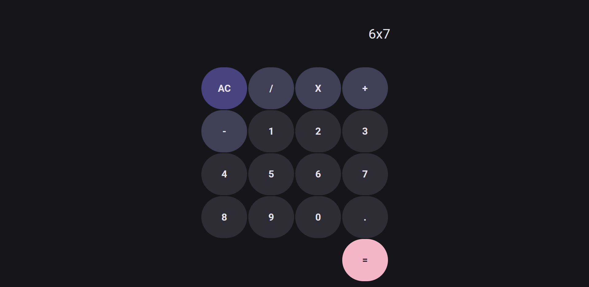

# Replica of the Google Calculator

Basically, just a very simple calculator, very similar to Google's! Build in an attempt to emulate a version very similar to Google's.

You can test it [Here!](https://brundevcoder.github.io/g-calculator/)

## How does it work?

Very simple! Just click on the operator buttons, numbers ... and at the end just press on the = button. Furthermore, I build this to avoid strange erros! Instead of showing values like `undefined` and `NaN`, I fixed it so that only "Error" appears!

## Details about the design:

- The font used here is `Roboto` by Google fonts.
- The colors throughout this project must be the same as in the original app, including: background color `#16151A`, AC button `#48427E`, operators `#403F56`, numbers and . `#2E2D35`, = button `#F5B5C8`. Also, all buttons should become lighter when you hover them!

## How to run it?
Simply clone this repository, then open the `index.html` file, or open Vs Code and use the Live Server Extension wich you can download [here](https://marketplace.visualstudio.com/items?itemName=ritwickdey.LiveServer) and click the "Go Live" at the bottom of Vs Code!